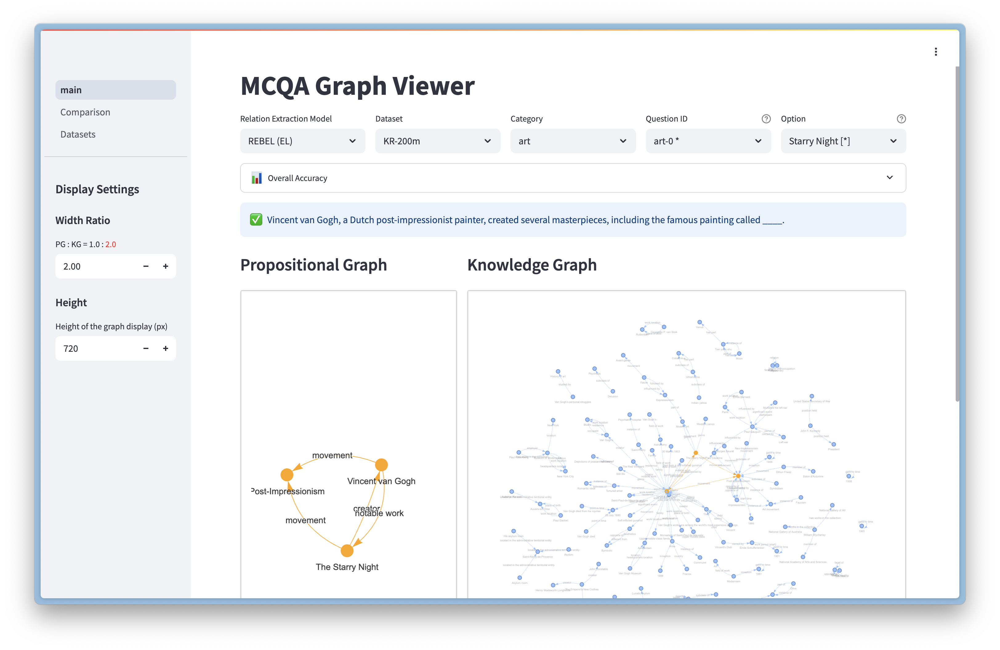

<h1 align="center">KG-MCQA</h1>

<p align="center">Source codes for KR 2025 workshop preprint<br>
<b>"Applying Relation Extraction and Graph Matching to Answering Multiple Choice Questions"</b>
<br>which is submitted to <a href="https://jurisinformaticscenter.github.io/NeLaMKRR2025/">NeLaMKRR 2025.</a></p>

This repository contains:

1. Python scripts for the answering experiment
1. Original MCQ datasets
1. Streamlit app for visualizing the results

## Setup

### Create Environment

Run the following command to create conda environment with required libraries. It automatically installs the original package `kgraph`.

```shell
conda env create -f environment.yml
conda activate kg-mcqa
```

### Activate Viewer

Activate [Streamlit](https://streamlit.io/) app for viewing datasets and experimental results.
While running the command, you can open the app in browser via [localhost:8501](http://127.0.0.1:8501).

```shell
streamlit run viewer/main.py
```



## Experiment

### Run all experiments

Following script runs all MCQA introduced in the article.

```
./scripts/mcqa_main.sh
```

### Single experiment

To run a single MCQA using specified RE method, use the next command.

```shell
python mcqa.py [dataset_path] [re_method]
```

Choice of `re_method` are as follows.
| `re_method` | Model name | Dataset | Relation types |
|-------------|--------------------|---------|------------|
| `rebel` | REBEL | REBEL | 220 |
| `mrebel` | mREBEL_400 | RED^{FM} | 400 |
| `mrebel_32` | mREBEL_32 | SRED^{FM} | 32 |
| `unirel` | UniRel | NYT | 24 |

## Files & Directories

### Files

- `mcqa.py`
- `fever.py`
- `environment.yml`

### Directories

(ignored) shows the files not controled by git.
- `kgraph`: Original package for handling proposed method.
- `scripts`
- `dataset`: Original MCQ dataset.
- `exp-mcqa`: Result files of MCQA.
- `KG_cache`: Cache files of KG constructed from Wikipedia articles. (ignored)
- `wikipedia`: Dowonloaded Wikipedia articles. (ignored)
